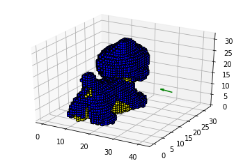

# NBV-Net:  A 3D Convolutional Neural Network for Predicting the Next-Best-View

This is a pytorch implementation of the network proposed by Mendoza for next best view planning.

J. Irving Vasquez-Gomez
[jivg.org]

The next best view is the sensor pose that increases the reconstructed surface of an object.

This implementation uses the NBV-dataset.

Some examples of the dataset are:

[jivg.org]: <https://jivg.org/>