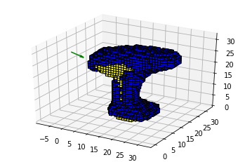
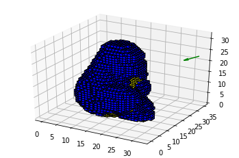

# NBV-Net:  A 3D Convolutional Neural Network for Predicting the Next-Best-View

This is a PyTorch implementation of the network proposed by Mendoza for next best view planning. 
Medoza's master thesis is:

> Miguel Mendoza, NBV-Net: una red neuronal convolucional 3D para predecir la siguiente mejor vista. Tesis de Maestría, Instituto Politécnico Nacional, 2018. 

The research paper is under review but you can use and cite our preprint:

> Mendoza, M., Vasquez-Gomez, J. I., Taud, H., Sucar, L. E., & Reta, C. (2019). Supervised Learning of the Next-Best-View for 3D Object Reconstruction. arXiv preprint arXiv:1905.05833.

This implementation uses the [NBV-Dataset]. Some examples of the dataset are:

Juan Irving Vasquez-Gomez  
[jivg.org]
Consejo Nacional de Ciencia y Tecnología